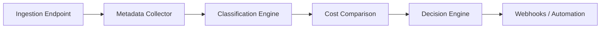

# CostIntel Pipeline - Technical Overview

## 1. Executive Summary
**CostIntel Pipeline (by Cloudteck)** is a scalable backend service that helps data engineers, FinOps teams, and cloud administrators reduce cloud bills. It achieves this by ingesting billing and telemetry data, extracting metadata, classifying resources by sensitivity and cost categories, and automating optimization decisions (such as tier switching, archiving, or rightsizing) across multi-cloud environments (AWS, GCP, Azure).

## 2. Technology Stack
- **Backend Framework:** Python 3.12 + FastAPI (async)
- **Database (OLTP & Metadata):** MySQL 8.0 with SQLAlchemy 2.0 (async ORM)
- **Caching & Message Broker:** Redis 7.0+
- **Background Processing:** Celery workers for async jobs and webhooks
- **Authentication:** JWT + API Keys (via PyJWT)
- **Machine Learning Layer:** scikit-learn (RandomForest for storage temperature classification)
- **Monitoring & Observability:** Prometheus metrics, Grafana dashboards, structured logging
- **Infrastructure:** Docker & Docker Compose (dev/prod), pre-configured for Nginx load balancing

## 3. High-Level Architecture

The platform operates through a metadata-driven pipeline architecture:

### Core Data Ingestion Flows
1. **Official API Ingestion:** Synchronizes data via external APIs with backoff/retry, storing raw and normalized payloads.
2. **Webhook-Based Real-Time Ingestion:** Event-driven ingestion verified by signatures and idempotency keys (`provider + event_id`).
3. **User-Submitted Data:** Direct API endpoint posts (`POST /v1/data/upload`) for processing batch files (CSV/JSON) or SDK events.

## 4. Key Engines & Modules (`app/`)

### 4.1. V2 Multi-Cloud Storage Optimization
The v2 engine expands CostIntel to execute **hybrid rule + ML storage lifecycle optimization**:
- **Collectors (`app/collectors`):** Event-driven access-log parsing and batch inventory ingestion. No file-body parsing happens—strictly metadata.
- **Rules Engine (`app/rules_engine`):** Baseline heuristic thresholds (e.g., days since last access, access frequency, object size, read/write ratio) to label data as `HOT`, `COLD`, or `ARCHIVE`.
- **ML Engine (`app/ml_engine`):** Uses a RandomForest model to predict storage temperature assignments alongside confidence scores. If confidence dips below `0.75`, the system gracefully falls back to the rules engine output.
- **Pricing Engine (`app/pricing_engine`):** Normalizes storage, retrieval, retention limits, and egress costs. Supported via a region-aware catalog (`pricing_catalog.json`) with currency conversion.
- **Decision Engine (`app/decision_engine`):** Evaluates alternatives across AWS, GCP, and Azure to synthesize actionable insights. Ranks options for cost savings and provides clear reasoning logs.
- **Migration Engine (`app/migration_engine`):** Facilitates **Zero-Trust Manual Migration**. Requires strict explicit approval, utilizes checksum validation, provides a fallback and rollback mechanism, and throttles parallel operations. Enforces a predefined execution path: `PLANNED -> DRY_RUN -> APPROVED -> EXECUTING -> COMPLETED`.

## 5. Security & Multi-Tenant Design
- **API Keys & Scopes:** API Gateway enforces authentication. External users process traffic via keys tracked for billing.
- **Zero-Trust Migrations:** Cross-cloud migrations refuse automatic UI execution natively, enforcing a verifiable, metadata-only tiering shift.
- **Idempotency:** Idempotency keys prevent double billing or duplicate webhook record insertion.

## 6. Current Development Status (Phase 2)
The current development stage focuses on **Integration Testing & Core Business Logic**.
- **Working Components:** FastAPI server, Celery logic, MySQL/Redis local stack, database migrations (`alembic` baseline applied), core REST API structure (auth stubs, public endpoints, dashboard).
- **Known Issue:** A `500 Internal Server Error` on User Registration (`POST /api/v1/auth/register`) preventing direct user additions. Currently bypassed locally via direct DB inserts.
- **Next Priorities:**
  1. Fix Authentication logic (registration, password hashing, JWT flow).
  2. Execute end-to-end pipeline run (file upload -> extract -> classify -> decide -> webhook).
  3. Validate background task performance via Celery queues.

## 7. Deployment Overview
- Designed for containerized VPS environments running Ubuntu.
- Configuration orchestrated via environment variables (`DATABASE_URL`, `REDIS_URL`, `ML_CONFIDENCE_THRESHOLD`).
- Scaling strategy includes multiple API containers behind Nginx, decoupled Celery worker scaling for complex ML classification or batch ingests, and MySQL read replicas for analytics queries.
